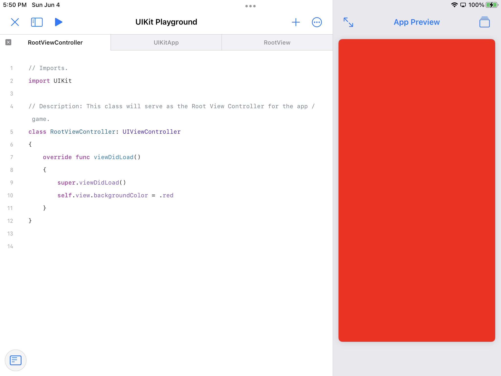

# UIKit Playground

A ready to use iPadOS Swift Playground app template, where the user will intend to use UIKit instead of SwiftUI. This allows the user to build apps in UIKit on iPad, while still utilizing the constant refresh ability of the Playgrounds canvas. This template includes a simple RootViewController with the view's background property set to red, and SwiftUI type called RootView that hosts the RootViewController.

 

## How to:

1. Download this code as a zip file via the green download button.
2. Go to the Files app & move the "UIKit Playground.swiftpm" file from Downloads, to the Swift Playgrounds shared iCloud folder.
3. Open Swift Playgrounds, and see that the new playground is showing.

 

 

	

